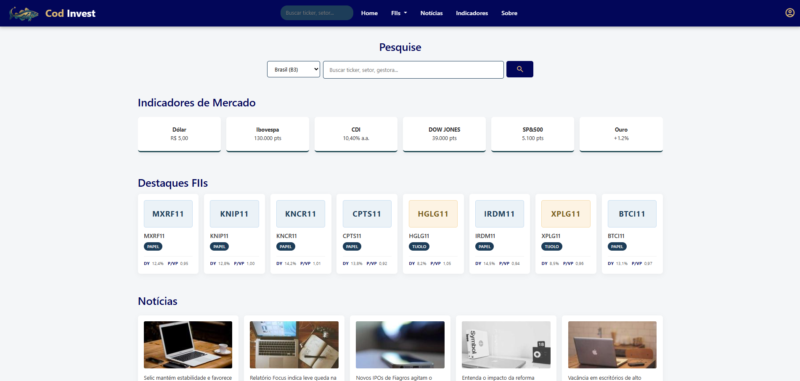
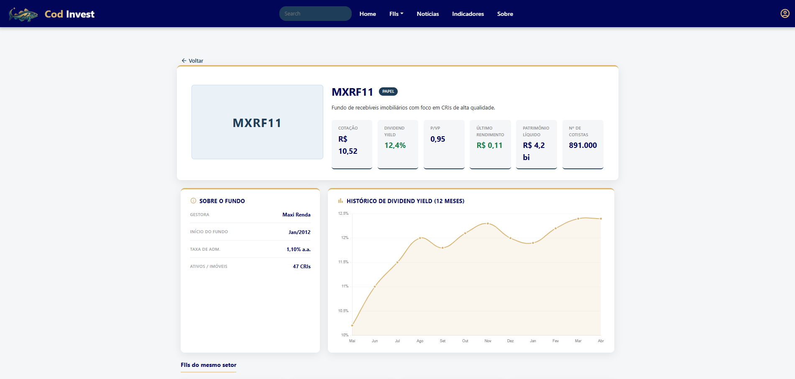
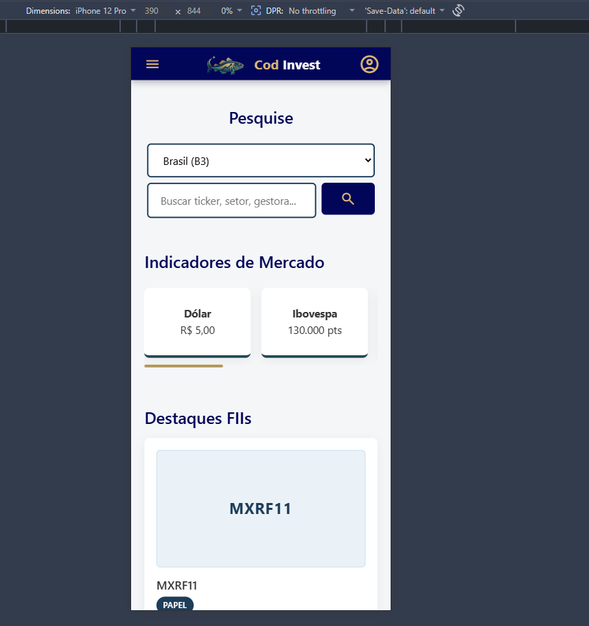
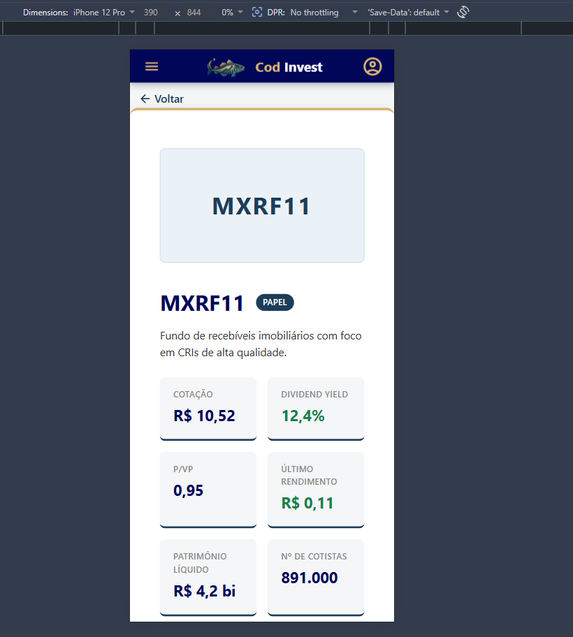
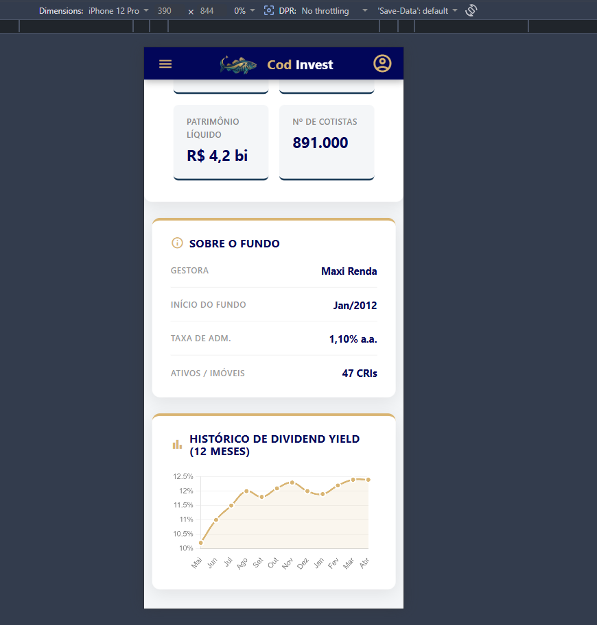

## COD Invest
Um painel de controle responsivo e intuitivo para o investidor focado em Fundos Imobiliários (FIIs).

## Informações Gerais
- breve descrição: Website para consultas de cotações e notícias de fundos imobiliários. Benchmarking: status invest e corretora Rico (XP inc.)
  
---

O mercado de Fundos Imobiliários (FIIs) exige rapidez e clareza. O Cod Invest nasce para transformar a complexidade dos indicadores financeiros em uma experiência visual intuitiva e responsiva. Mais do que um dashboard, é uma central de comando para o investidor moderno que busca monitorar proventos, notícias e oscilações do mercado em tempo real, sem perder o foco no que realmente importa: a rentabilidade.

## Funcionalidades
 
- **Busca com autocomplete** — filtra FIIs em tempo real por ticker, setor ou gestora; Enter redireciona direto para a página de detalhes
- **Filtro por setor** — dropdown do menu filtra os cards por Tijolo, Papel, Híbrido, Fiagro, Fundo de Fundos ou Hoteleiro
- **Destaques dinâmicos** — exibe os 8 FIIs com maior número de cotistas na home
- **Página de detalhes** — cotação, DY, P/VP, patrimônio, vacância, gráfico histórico de DY e FIIs relacionados do mesmo setor
- **Avatares por setor** — cards identificados por cor e ticker no lugar de imagens genéricas
- **Indicadores de mercado** — scroll horizontal com Dólar, Ibovespa, CDI, Dow Jones, S&P 500 e Ouro
- **Layout responsivo** — navbar com offcanvas no mobile, menu dropdown no desktop
- **Base de dados estática** — 40 FIIs distribuídos em 6 setores

---

## Estrutura de branches
 
| Branch | Descrição |
|--------|-----------|
| `main` | Código estável |
| `develop` | Integração contínua |
| `v1-html-css` | Versão estática em HTML e CSS puro |
| `v2-html-css-bootstrap` | Versão com Bootstrap integrado |
| `v3-javascript-dinamico` | Versão com JS dinâmico e dados estáticos |
| `v4-javascript-api` | Versão com integração à brAPI |
 
---

## Print da versão com JS

 

 

