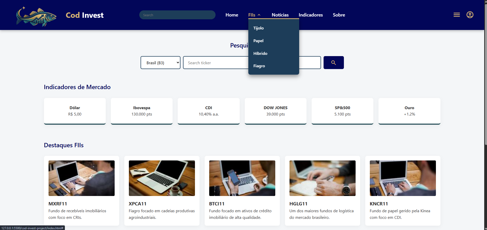

## Informações Gerais
- proposta de projeto escolhida: Coleções e Itens
- breve descrição: Website para consultas de cotações e notícias de fundos imobiliários. Benchmarking: status invest e corretora Rico (XP inc.)
  
---

O mercado de Fundos Imobiliários (FIIs) exige rapidez e clareza. O Cod Invest nasce para transformar a complexidade dos indicadores financeiros em uma experiência visual intuitiva e responsiva. Mais do que um dashboard, é uma central de comando para o investidor moderno que busca monitorar proventos, notícias e oscilações do mercado em tempo real, sem perder o foco no que realmente importa: a rentabilidade.
  
---
## Print Wireframe

---
## Print da tela

