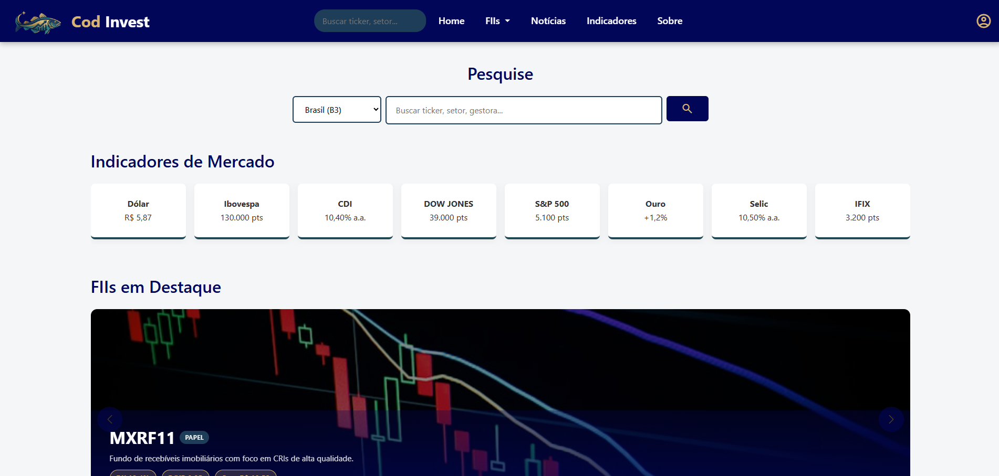
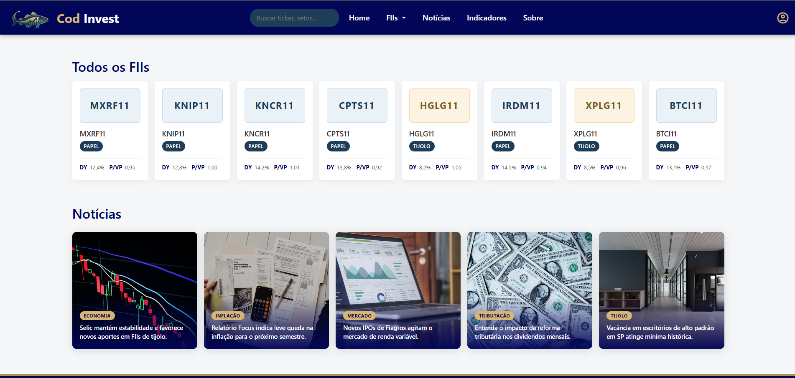
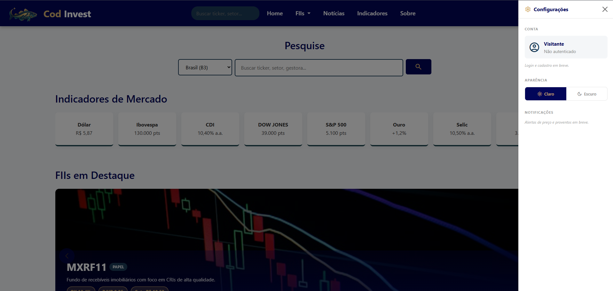
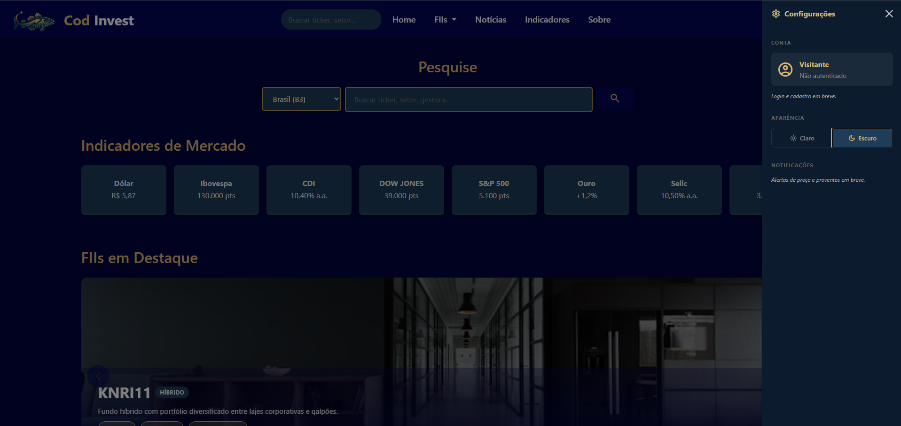
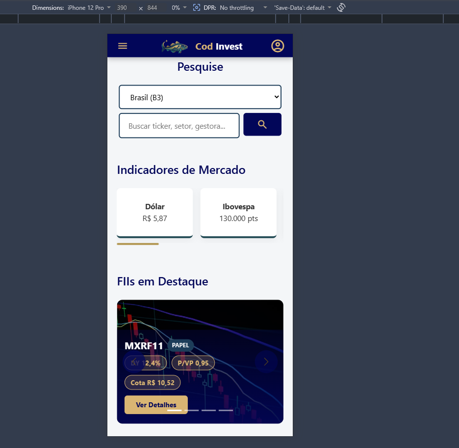
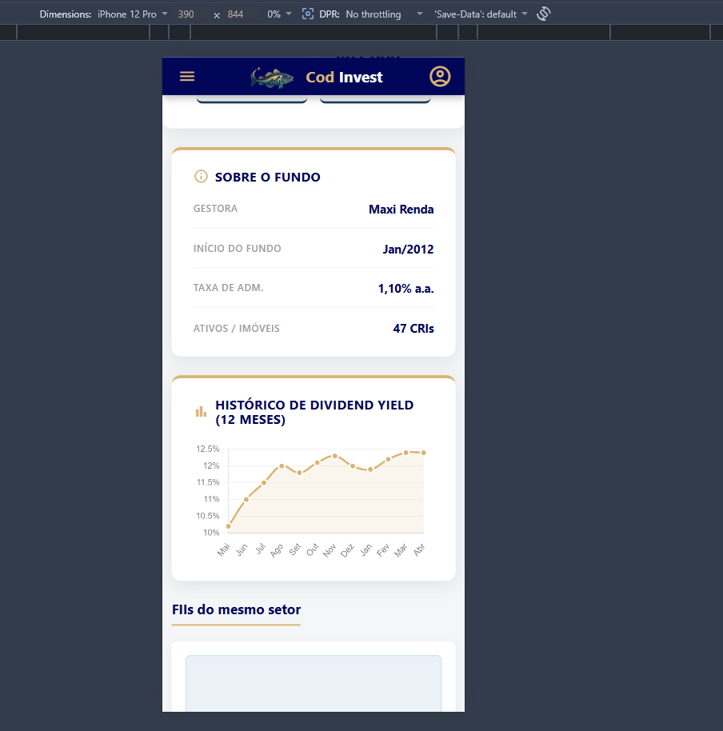
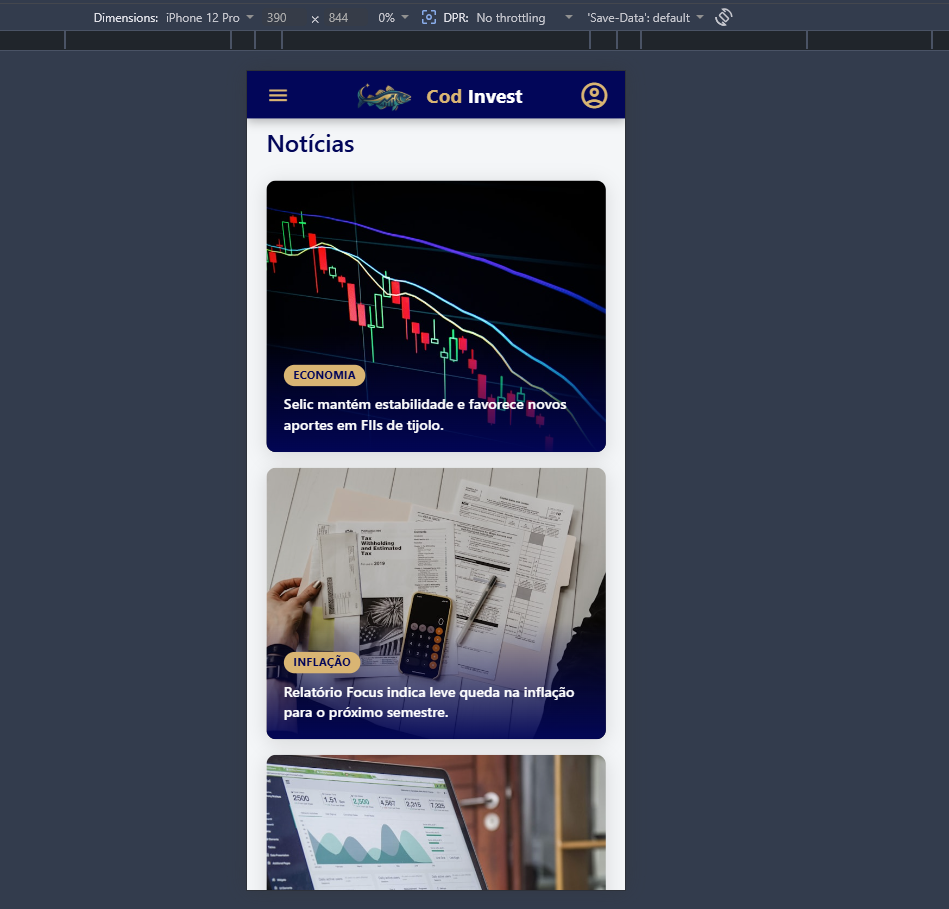

# COD Invest

Um painel de controle responsivo e intuitivo desenhado de investidor para investidor, com foco exclusivo em Fundos Imobiliários (FIIs).

## Informações Gerais

O mercado de Fundos Imobiliários (FIIs) exige rapidez e clareza. O Cod Invest nasce para transformar a complexidade dos indicadores financeiros em uma experiência visual intuitiva e responsiva. Mais do que um dashboard, é uma central de comando para o investidor moderno que busca monitorar proventos, notícias e oscilações do mercado em tempo real, sem perder o foco no que realmente importa: a rentabilidade.

**Benchmarking:** Status Invest e Corretora Rico (XP Inc.)

---

## Telas da Aplicação

### Versão Web

  
  
    
  
  

### Versão Mobile

  
  
  

---

## Funcionalidades

* **Busca com Autocomplete:** Filtra FIIs em tempo real por *ticker*, setor ou gestora. Pressionar *Enter* redireciona direto para a página de detalhes.
* **Filtro por Setor:** Dropdown no menu filtra os cards pelas categorias: Tijolo, Papel, Híbrido, Fiagro, Fundo de Fundos (FoF) ou Hoteleiro.
* **Destaques Dinâmicos:** Exibe os 8 FIIs com o maior número de cotistas logo na página inicial (*Home*).
* **Página de Detalhes Completa:** Apresenta dados essenciais como Cotação, *Dividend Yield* (DY), P/VP, Patrimônio Líquido, Vacância, Gráfico histórico de DY e FIIs relacionados do mesmo setor.
* **Avatares por Setor:** Cards identificados visualmente por cor e *ticker* no lugar de imagens genéricas, facilitando a leitura rápida.
* **Indicadores de Mercado:** *Scroll* horizontal no topo informando variações do Dólar, Ibovespa, CDI, Dow Jones, S&P 500 e Ouro.
* **Layout Responsivo:** *Navbar* com *offcanvas* nativo para dispositivos móveis e menu *dropdown* fluido no desktop.
* **Base de Dados Dinâmica (Mock/API):** O projeto iniciou com 40 FIIs distribuídos em 6 setores, evoluindo para uso de dados mockados e integrações de API.

---

## Tecnologias Utilizadas

* **Front-end:** HTML5, CSS3, JavaScript e Bootstrap
* **Dados/API:** Dados estáticos (JSON), `json-server` (Mock REST API) e brAPI
* **Controle de Versão:** Git e GitHub

---

## Estrutura de Branches

O desenvolvimento seguiu uma esteira lógica de evolução, separada pelas seguintes *branches*:

| Branch | Descrição |
|--------|-----------|
| `main` | Código estável e versão de produção |
| `develop` | Branch base para integração contínua de novas *features* |
| `v1-html-css` | Primeira versão: Estrutura estática em HTML e CSS puro |
| `v2-html-css-bootstrap` | Segunda versão: Refatoração de layout integrando o *framework* Bootstrap |
| `v3-javascript-dinamico` | Terceira versão: Inclusão de JS dinâmico renderizando dados de uma base estática/mock |
| `v4-javascript-api` | Quarta versão: Evolução final integrando o painel de FIIs à **brAPI** |
